# Awesome Machine Monitoring ⚙️

<p align="center">
  
</p>

<p align="center">
  <a href="https://github.com/ishandutta2007/Awesome-Awesome-Awesome"></a><a href="https://discord.gg/jc4xtF58Ve"></a>
  <a href="https://github.com/ishandutta2007/Awesome-Machine-Monitoring/stargazers"></a>
  <a href="https://github.com/ishandutta2007/Awesome-Machine-Monitoring/network/members"></a>
  <a href="https://github.com/ishandutta2007/Awesome-Machine-Monitoring/issues"></a>
  <a href="https://github.com/ishandutta2007/Awesome-Machine-Monitoring/blob/main/LICENSE"></a>
  <a href="https://github.com/ishandutta2007"></a>
</p>

## 📌 Top Machine Monitoring Ecosystem & Predictive Maintenance Frameworks

> A curated list of **Industrial Machine Monitoring SaaS platforms**, **Predictive Maintenance (PdM)** systems, **Overall Equipment Effectiveness (OEE)** calculators, **Industrial IoT (IIoT)** telemetry pipelines, and **Open-Source Machine Health** frameworks.

*Last updated: September 2026* 🗓️

---

This repository tracks notable **SaaS platforms** and **open-source projects** for **Machine Monitoring**. These software systems collect real-time industrial data from CNC machines, rotating equipment, robotics, and industrial assets to calculate OEE, detect anomalies, forecast failures via physics-informed & ML algorithms, reduce unplanned downtime, and optimize factory floor productivity.

---

## 📑 Table of Contents

- [🏭 SaaS / Hosted Platforms](#-saas--hosted-platforms)
- [🔓 Open-Source GitHub Projects](#-open-source-github-projects)
- [🛠️ Composable Stack Building Blocks](#%EF%B8%8F-composable-stack-building-blocks)
- [🤝 How to Contribute](#-how-to-contribute)
- [💖 Support & Sponsorship](#-support--sponsorship)
- [⚠️ Disclaimer](#%EF%B8%8F-disclaimer)
- [📈 Star History](#-star-history)

---

## 🏭 SaaS / Hosted Platforms

> **Market Insights:** The global Machine Monitoring & Predictive Maintenance market size is estimated at **$10.5 Billion in 2026** (projected to reach $28+ Billion by 2032 at a CAGR of ~22%). The sector is currently **moderately fragmented**, featuring a mix of hyper-specialized AI startups (e.g., Augury, MachineMetrics) and established industrial automation giants (Siemens, SymphonyAI, PTC) expanding via strategic acquisitions.

| Platform 🚀 | Starting Tier Price 💰 | Free Tier / Trial Limit ⏳ | Valuation / Revenue / Company Size 📊 | Key Strengths & Focus Areas 🎯 |
| :--- | :--- | :--- | :--- | :--- |
| **[Senseye (Siemens)](https://www.senseye.io/)** | ~$1,500 / machine / year | 14-day enterprise proof-of-concept trial (up to 5 assets) | Parent Siemens ($140B+ Market Cap, Senseye acquired for ~$100M) | Automated health insights, RUL prognosis, deep Siemens MindSphere integration. |
| **[Augury](https://www.augury.com/)** | ~$1,200 / asset / year | 30-day piloted machine trial (includes sensor hardware setup) | $1.0B+ Valuation (Unicorn status, $250M+ total funding) | Vibration & ultrasonic sensor diagnostics for critical rotating machinery. |
| **[MachineMetrics](https://www.machinemetrics.com/)** | ~$300 / machine / month | 14-day free trial (up to 3 CNC machine edge connectors) | $100M+ Valuation ($38M+ Series B funding, 100-200 employees) | CNC & discrete manufacturing OEE, real-time cycle-time analytics, MTConnect. |
| **[Litmus Automation](https://litmus.io/)** | ~$250 / edge device / month | 30-day full-feature trial (up to 2 Litmus Edge gateways) | ~$50M Valuation ($15M+ Series A funding, 50-100 employees) | OT-to-IT data normalization, industrial edge computing, multi-site OEE. |
| **[Seeq](https://www.seeq.com/)** | ~$10,000 / enterprise user / year | 14-day hosted trial (with sample time-series datasets) | ~$200M Valuation ($115M+ total funding, 200+ employees) | Advanced time-series analytics, process manufacturing intelligence, diagnostic AI. |
| **[SymphonyAI Industrial](https://www.symphonyai.com/)** | ~$25,000 / site / year | 30-day guided evaluation environment | Division of SymphonyAI ($1B+ group valuation, enterprise SaaS) | Industrial AI, process anomaly detection, vibration analysis, asset performance. |
| **[Braincube](https://braincube.com/)** | ~$1,500 / month | 14-day demo workspace access | ~$100M Valuation ($83M+ funding, 200+ employees) | Edge-to-cloud industrial analytics, digital twin modeling, process optimization. |
| **[HighByte](https://www.highbyte.com/)** | ~$5,000 / hub / year | 2-hour reset trial per session (free deployment download) | ~$30M Valuation ($12M+ funding, 20-50 employees) | Industrial DataOps, OT data modeling, OPC-UA/MQTT contextualization hub. |

---

## 🔓 Open-Source GitHub Projects

Below is a curated list of open-source projects, time-series historians, IIoT platforms, and protocol bridges essential for constructing self-hosted machine monitoring and predictive maintenance pipelines.

*Sorted by GitHub_Stars_Count (Descending):*

- **[Grafana](https://github.com/grafana/grafana)** [](https://github.com/grafana/grafana/stargazers)  
  ⚡ The open and composable analytics and observability platform. Widely used to visualize real-time machine telemetry, vibration data, and shop-floor OEE dashboards.

- **[InfluxDB](https://github.com/influxdata/influxdb)** [](https://github.com/influxdata/influxdb/stargazers)  
  ⏱️ Scalable open-source time-series database optimized for high-frequency sensor telemetry, machine state logging, and industrial analytics.

- **[Node-RED](https://github.com/node-red/node-red)** [](https://github.com/node-red/node-red/stargazers)  
  🔌 Low-code programming tool for wiring together hardware devices, APIs, and industrial protocols (Modbus, OPC-UA, MQTT) at the edge.

- **[TimescaleDB](https://github.com/timescale/timescaledb)** [](https://github.com/timescale/timescaledb/stargazers)  
  🐘 Open-source time-series SQL database built on PostgreSQL, ideal for machine health event logs and long-term asset trend analysis.

- **[ThingsBoard](https://github.com/thingsboard/thingsboard)** [](https://github.com/thingsboard/thingsboard/stargazers)  
  📊 Open-source IoT platform for device management, data collection, processing, and rich real-time asset monitoring dashboards.

- **[Eclipse Mosquitto](https://github.com/eclipse/mosquitto)** [](https://github.com/eclipse/mosquitto/stargazers)  
  MQTT Open-source lightweight MQTT message broker, suitable for IoT telemetry streaming from factory floor sensors to central monitoring systems.

- **[open62541](https://github.com/open62541/open62541)** [](https://github.com/open62541/open62541/stargazers)  
  🤖 Open-source C implementation of OPC UA (IEC 62541) protocol stack, enabling direct machine-to-cloud communication.

- **[Apache PLC4X](https://github.com/apache/plc4x)** [](https://github.com/apache/plc4x/stargazers)  
  🏭 Industrial protocol integration library that allows unified communication with PLCs (Siemens S7, Allen-Bradley, Modbus) without proprietary drivers.

- **[Apache StreamPipes](https://github.com/apache/streampipes)** [](https://github.com/apache/streampipes/stargazers)  
  🌊 Industrial IoT toolbox to enable non-technical users to connect, analyze, and explore IIoT data streams for anomaly detection.

- **[EsoCore](https://www.esocore.com/)** [](https://github.com/esocore)  
  ⚙️ Open-source IIoT platform for equipment health monitoring, modular vibration/temperature sensors, and predictive maintenance analytics.

---

## 🛠️ Composable Stack Building Blocks

Full commercial machine-health platforms with proprietary hardware sensors and physics-informed AI remain popular for enterprise rollouts. However, open-source architectures center around composable modular stacks:

```
[ Industrial Sensors / PLCs ] 
              │ (Modbus / OPC-UA / MTConnect)
              ▼
    [ Edge Gateway (Node-RED / Apache PLC4X) ]
              │ (MQTT Streams)
              ▼
   [ Message Broker (Eclipse Mosquitto) ]
              │
              ▼
 [ Time-Series Storage (InfluxDB / TimescaleDB) ]
              │
              ▼
 [ Analytics & Visualization (Grafana / ThingsBoard) ]
```

---

## 🤝 How to Contribute

1. Fork this repository 🍴
2. Add or update entries in `README.md` following the table or list schema.
3. Provide accurate pricing, trial specifications, or repository URLs.
4. Submit a Pull Request (PR) with a brief description.

---

## 💖 Support & Sponsorship

Thank you for exploring **Awesome Machine Monitoring**! ⚙️ If this repository has helped you evaluate industrial IoT platforms, design predictive maintenance workflows, or discover useful open-source tools, please consider supporting the project:

- ⭐ **Star** this repository to show your support and make it more discoverable.
- 🍴 **Fork** it to keep your own copy and contribute improvements.
- 📢 **Share** it with fellow manufacturing engineers, OT/IT teams, and developers!

<p align="left">
  <a href="https://github.com/sponsors/ishandutta2007">
    
  </a>
</p>

Your contributions and support help maintain and expand this community resource!

---

## ⚠️ Disclaimer

- This list is **community-curated** and for educational/reference purposes only.
- Machine monitoring and predictive maintenance systems directly impact factory safety and production decisions. Always validate models and data pipelines before relying on them for critical operations.

---

## 📈 Star History

[](https://star-history.dera.page/#ishandutta2007/Awesome-Machine-Monitoring&type=date&legend=top-left)

---

<p align="center">
  <b>Made with ❤️ for manufacturing engineers, OT/IT architects, and industrial data scientists.</b>
</p>
